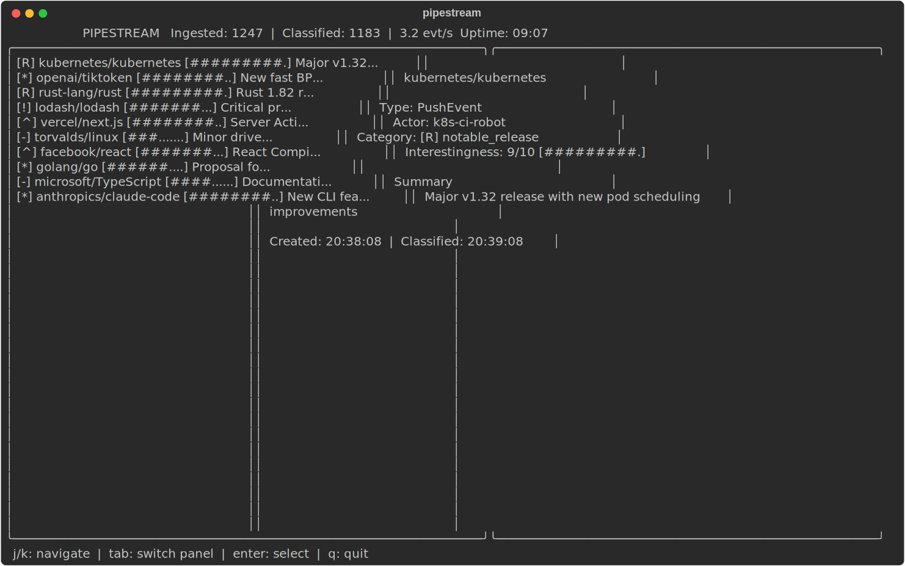

# pipestream

Real-time data pipeline with AI classification.

A Go service that ingests live GitHub public events, classifies them using Claude AI, and presents results in a beautiful terminal dashboard. Events are persisted to SQLite and available via REST and WebSocket API.



## Features

- Real-time GitHub event ingestion with deduplication
- AI-powered classification using Claude: notable release, interesting project, security concern, trending, or routine
- Interestingness scoring for prioritized event surfacing
- Full terminal dashboard built with Bubbletea and Lipgloss
- SQLite persistence for durable event storage
- REST API and WebSocket endpoint for live updates
- Dry-run mode for testing without API calls

## Tech Stack

- Go 1.22+
- [Bubbletea](https://github.com/charmbracelet/bubbletea) -- terminal UI framework
- [Lipgloss](https://github.com/charmbracelet/lipgloss) -- terminal styling
- [Cobra](https://github.com/spf13/cobra) -- CLI framework
- SQLite via pure-Go driver
- Claude API for event classification

## Installation

```bash
git clone https://github.com/kokinedo/pipestream.git
cd pipestream
go build -o pipestream .
```

## Authentication

pipestream supports multiple AI providers for event classification. Use the built-in login flow:

```bash
pipestream login                       # default: Claude
pipestream login --provider openai     # OpenAI
pipestream login --provider gemini     # Google Gemini
```

This opens your browser to the provider's API key page, prompts you to paste the key, and stores it locally at `~/.config/pipestream/credentials.json`.

Alternatively, set environment variables:

```bash
export ANTHROPIC_API_KEY="your-key"   # Claude
export OPENAI_API_KEY="your-key"      # OpenAI
export GEMINI_API_KEY="your-key"      # Gemini
export GITHUB_TOKEN="your-token"      # GitHub (optional, increases rate limit)
```

To remove stored credentials:

```bash
pipestream logout --provider claude
```

## Usage

Start the pipeline with the TUI dashboard:

```bash
./pipestream
```

Run in dry-run mode (skips AI classification, uses mock data):

```bash
./pipestream --dry-run
```

Use a different provider:

```bash
./pipestream --provider openai
./pipestream --provider gemini --model gemini-2.0-flash
```

Run in headless mode (no TUI, API only):

```bash
./pipestream --headless
```

## Architecture

```
GitHub Public Events
        |
    Ingester  -- polls events, deduplicates
        |
   Classifier -- Claude AI scoring and categorization
        |
      Store   -- SQLite persistence
       / \
      /   \
   Server  TUI
 (REST/WS) (Bubbletea dashboard)
```

## License

MIT
